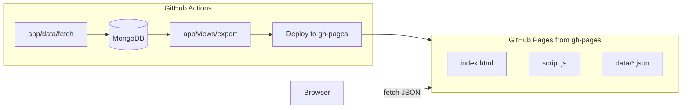

# IPMA Weather Data Fetcher

## 🌤️ Overview

This app automatically retrieves weather data from [IPMA](https://api.ipma.pt/) stations and stores **Ansião** station data in a MongoDB cluster.

The main goal is to **support agricultural decisions** in my red fruit exploration by analyzing key weather parameters like temperature, precipitation, humidity, and more.

By adopting this data-driven approach, I aim to **optimize irrigation systems**, improving resource efficiency and sustainability (hopefully, in the near bright future! 😉).

---

## 🚀 Features

- **Fetches** selected weather data (temperature, precipitation, humidity, wind, radiation) for the last 24 hours from:
  > [https://api.ipma.pt/open-data/observation/meteorology/stations/observations.json](https://api.ipma.pt/open-data/observation/meteorology/stations/observations.json)

- **Stores** data in MongoDB for easy querying and analysis.

- **Static snapshot pipeline**: GitHub Actions (`.github/workflows/schedule.yml`) runs every 2 hours: fetches data into MongoDB, then runs the export script to generate static JSON files and copies the frontend into `dist/`. Only that build output is deployed to the **gh-pages** branch. Generated files are never committed to main.
- You can run fetch or export locally when needed (see Running below).

---

## 🛠️ Scripts

| Script | Purpose |
|--------|--------|
| `app/data/fetch.py` | Fetches data from IPMA and stores it in MongoDB. |
| `app/views/export.py` | Build step: reads MongoDB (and Meteoblue/IPMA APIs), writes `dist/data/*.json` and copies `index.html` and `app/static` into `dist/`. Used by CI; run locally with `MONGO_URI` to preview the site. |
| `app/views/analyze.py` | Produces summarized datasets (cold hours, missing entries, observations) used by the export and view. |
| `app/utils.py` | Shared helpers for parsing, cleaning, and transformations. |

---

## 🏗️ Architecture

The site is static: GitHub Pages serves only files from the **gh-pages** branch. The browser cannot connect to MongoDB. The CI workflow runs with `MONGO_URI` in GitHub Actions, reads MongoDB and live APIs, and writes static JSON files into `dist/data/`. The frontend (`index.html` + `app/static/script.js`) loads data via `fetch('data/observations.json')` etc. from that deployed output.



- **main (or default branch)**: Source code only. No `dist/`, no `data/*.json`, no `tables.js` in version control.
- **gh-pages**: Only the contents of `dist/` after each run: `index.html`, `app/static/script.js`, `app/static/css/style.css`, `data/*.json`. Configure GitHub Pages in repo settings to **Deploy from branch** → **gh-pages** (root).

### Data sources used by the export

- MongoDB collections (observations, precipitation, evapotranspiration)
- Meteoblue forecast (live at build time)
- IPMA warnings (live at build time)

---

## 🔭 Date search (future)

The export writes a larger window of observations (e.g. last ~30 days) into `data/observations.json`. To support searching by date in the UI, add a date range filter in the frontend and filter the already-loaded JSON in the browser. No backend required; all filtering is client-side.

---

## ✅ Roadmap & Tasks

### **Main Objectives**

- [x] **Cold hours**: Analyze how many hours were below 7°C.
- [ ] **Forecasts**: Fetch weather forecasts and warnings.
- [ ] **Resources optimization**: Analyze weather data to adjust irrigation schedules.

---

### **Development Tasks**

- [x] Fix invalid values (e.g., negative `precAcumulada`, `pressao`).
- [x] Count hours below 7.2°C per day and per month.
- [ ] **Add columns** for enhanced analysis: date, time, year, month, day.
- [ ] **Calculate** monthly min, avg, and max temperatures.
- [ ] Analyze the **distribution of relative humidity** over the year.
- [ ] Examine **precipitation trends** to guide irrigation.
- [ ] Create **line charts** for temperature and humidity evolution.
- [ ] Plot **histograms** for ideal temperatures (<7.2°C and 16–27°C).
- [ ] Generate **heatmaps** for critical humidity or cold periods.

---

## 💡 Notes

- Data is primarily gathered from **Ansião station** (`1210716`).
- `utils.py` contains handy tools to parse, clean, and check dataset consistency.
- The **GitHub Actions workflow** ensures **daily automation**, crucial for building reliable time series.


---

## ⚙️ How to Use

### 1. Setup

- Edit `app/data/connections.py` to set your **MongoDB collection** and **IPMA desired station** ID.
- Create a `.env` file in the project root with your MongoDB URI:
```
MONGO_URI="your-mongodb-cluster-uri"
```

### 2. Install dependencies

- Make sure you have Python 3.9+ installed.
- Install all necessary packages using `requirements.txt`:
```
pip install -r requirements.txt
```

### 3. Running

- **Fetch** (writes to MongoDB; requires `MONGO_URI` in `.env`):
  ```bash
  python -m app.data.fetch
  ```

- **Export** (builds `dist/`: reads MongoDB and APIs, writes `dist/data/*.json` and copies static assets; requires `MONGO_URI`):
  ```bash
  python -m app.views.export
  ```
  Then **serve the `dist/` folder** (not the project root), so that `data/*.json` resolve to `dist/data/*.json`:
  - Open `dist/index.html` in a browser, or
  - Run a local server with **document root = `dist/`** (e.g. `cd dist && python -m http.server 5500`, or in VS Code Live Server set the root to `dist/`).  
  If you serve from the repo root, requests to `data/*.json` will 404 because those files only exist inside `dist/`. The live site is served from the **gh-pages** branch after each CI run.

---
