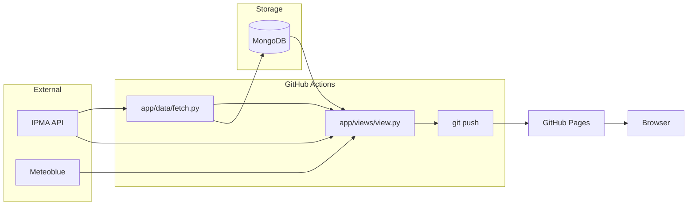

# IPMA Weather Data Fetcher

## 🌤️ Overview

This app automatically retrieves weather data from [IPMA](https://api.ipma.pt/) stations and stores **Ansião** station data in a MongoDB cluster.

The main goal is to **support agricultural decisions** in my red fruit exploration by analyzing key weather parameters like temperature, precipitation, humidity, and more.

By adopting this data-driven approach, I aim to **optimize irrigation systems**, improving resource efficiency and sustainability (hopefully, in the near bright future! 😉).

---

## 🚀 Features

- **Fetches** selected weather data (temperature, precipitation, humidity, wind, radiation) for the last 24 hours from:
  > [https://api.ipma.pt/open-data/observation/meteorology/stations/observations.json](https://api.ipma.pt/open-data/observation/meteorology/stations/observations.json)

- **Stores** data in MongoDB for easy querying and analysis.

- **Automated fetching and view generation**:
  - GitHub Actions workflow runs every 2 hours (`.github/workflows/schedule.yml`) to fetch data and refresh the static view.
  - Local batch/script execution is still available for manual runs.

---

## 🛠️ Scripts

| Script | Purpose |
|-------------|-----------------------------------------------------------------|
| `app/data/fetch.py` | Fetches data from IPMA and stores it in MongoDB. |
| `app/views/view.py` | Builds the static website outputs: `index.html` and `app/static/tables.js`. |
| `app/views/analyze.py` | Produces summarized datasets used by the view (cold hours, missing entries, observations). |
| `app/utils.py` | Shared helpers for parsing, cleaning, and transformations. |

---

## 🏗️ Architecture

GitHub Pages serves static files only. The browser cannot safely connect directly to MongoDB, so the view is pre-rendered in CI.



The CI workflow runs with `MONGO_URI`, reads MongoDB plus live API data, writes static outputs, commits them, and GitHub Pages serves those files.

### Data sources used by `app/views/view.py`

- MongoDB collections (observations, precipitation, evapotranspiration)
- Meteoblue forecast data
- IPMA warnings data

---

## 🔭 Future: Date Search

To support searching by arbitrary dates, keep the static snapshot workflow and add a small backend API:

- Example endpoints:
  - `GET /api/observations?from=YYYY-MM-DD&to=YYYY-MM-DD`
  - `GET /api/evapotranspiration?date=YYYY-MM-DD`
  - `GET /api/precipitation?date=YYYY-MM-DD`
- Frontend adds a date picker and fetches JSON from that API.
- Existing CI flow (`fetch -> view -> static deploy`) remains unchanged for the latest snapshot.

---

## ✅ Roadmap & Tasks

### **Main Objectives**

- [x] **Cold hours**: Analyze how many hours were below 7°C.
- [ ] **Forecasts**: Fetch weather forecasts and warnings.
- [ ] **Resources optimization**: Analyze weather data to adjust irrigation schedules.

---

### **Development Tasks**

- [x] Fix invalid values (e.g., negative `precAcumulada`, `pressao`).
- [x] Count hours below 7.2°C per day and per month.
- [ ] **Add columns** for enhanced analysis: date, time, year, month, day.
- [ ] **Calculate** monthly min, avg, and max temperatures.
- [ ] Analyze the **distribution of relative humidity** over the year.
- [ ] Examine **precipitation trends** to guide irrigation.
- [ ] Create **line charts** for temperature and humidity evolution.
- [ ] Plot **histograms** for ideal temperatures (<7.2°C and 16–27°C).
- [ ] Generate **heatmaps** for critical humidity or cold periods.

---

## 💡 Notes

- Data is primarily gathered from **Ansião station** (`1210716`).
- `utils.py` contains handy tools to parse, clean, and check dataset consistency.
- The **GitHub Actions workflow** ensures **daily automation**, crucial for building reliable time series.


---

## ⚙️ How to Use

### 1. Setup

- Edit `app/data/connections.py` to set your **MongoDB collection** and **IPMA desired station** ID.
- Create a `.env` file in the project root with your MongoDB URI:
```
MONGO_URI="your-mongodb-cluster-uri"
```

### 2. Install dependencies

- Make sure you have Python 3.9+ installed.
- Install all necessary packages using `requirements.txt`:
```
pip install -r requirements.txt
```

### 3. Running

- Run fetch to get and store data:
```
python -m app.data.fetch
```

- Run view build to generate static files (`index.html` and `app/static/tables.js`):
```
python -m app.views.view
```

---
